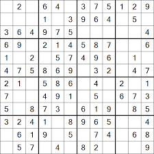
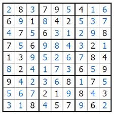

# 🔙 Backtracking

Backtracking es una técnica algorítmica 🧠 para explorar diferentes caminos para llegar a una solución. Esto se hace por medio de la recursividad 🔁 al virar hacia atrás.

Las soluciones con backtracking lo que se hace es una búsqueda en profundidad o Deep First Search (DFS). La idea es convertir el problema en una secuencia de estados 📊.  
Cada cambio sería un estado.  
Por ejemplo con el sudoku:



Se tiene el estado inicial que sería un sudoku sin resolver 🧩



Y se tiene un estado final que sería un sudoku resuelto ✅

Para moverte del estado inicial al final tienes que hacer cambios:  

* 🔢 Probar con un número  
* ✅ Ver si cumple con las restricciones  
* 🔁 Si cumple con las restricciones, repetir  
* ❌ Si no cumple con las restricciones, descartar ese número (backtracking) y repetir


A grandes rasgos, un algoritmo de DFS se puede generalizar de esta forma:  

* ➡️ Moverte hacia un estado  
* 🔍 Comprobar si es válido ese estado  
* ✅ Si cumple, repetir (seguir probando a partir de ese nuevo estado)  
* 🔙 Si no cumple, se descarta ese estado y se repite (al hacerse backtracking se comienza desde el estado anterior; si no funciona, vuelve a ir hacia atrás)


## 🧩 ¿Cómo se aplica esto en el sudoku?

Tenemos entonces el estado inicial del sudoku comenzado.  
Ahora lo ideal sería probar cada estado.  
¿Cómo hacer eso? 🤔  
Pues lo que se puede hacer es recorrer la matriz del sudoku y probar cada número y ver si funciona. Un poco a lo bruto 💪.

La esencia del algoritmo que está en el script está en esta línea:
```python
for num in range(1, 10):
    if is_safe(mat, row, col, num):
        mat[row][col] = num
        if solve_sudoku(mat, row, col + 1, time_step):
            return True
        mat[row][col] = 0
```


### ¿Qué sucede ahí?  
* 🔁 Recorres desde el 1 hasta el 9 (range no incluye el límite superior)  
* 🧪 Y a probar: se comprueba si es posible y, en ese caso, se selecciona y se repite la función pero con el nuevo estado para ver si encuentra la solución.  
* ✅ Si la encuentra, se devuelve True para que se pueda comprobar que llegó a la solución.  
* 🔙 En caso de que no, se vira hacia atrás: se descarta ese número, por eso se vuelve a agregar un 0, ya que es la forma de descartar el estado en este caso — si antes había un número, ahora no hay ninguno.
